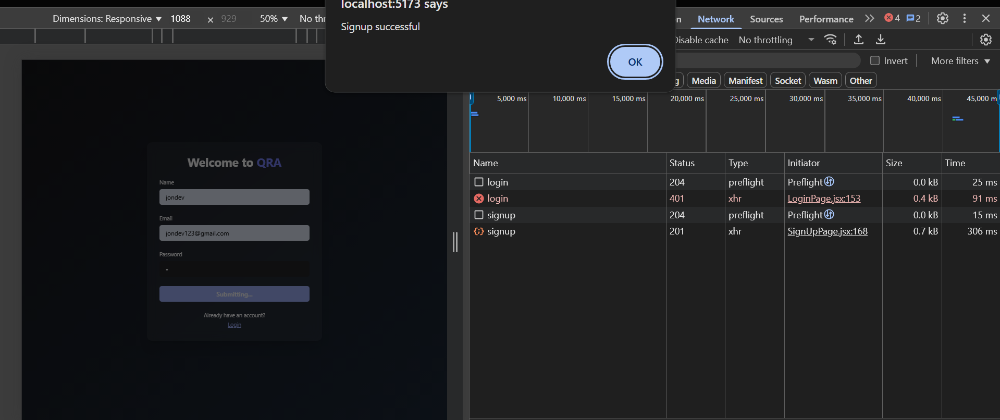
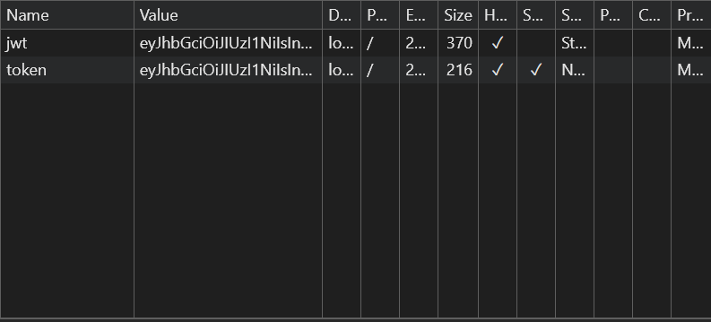
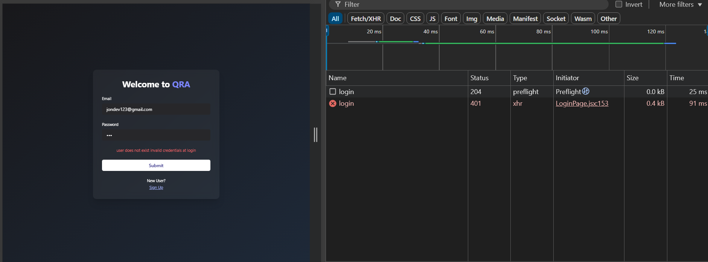
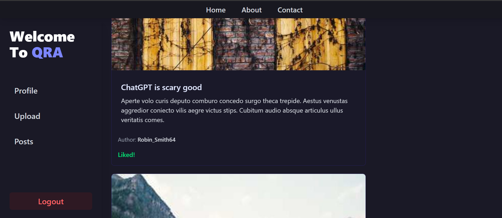
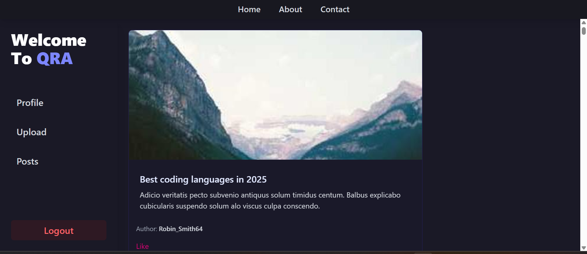
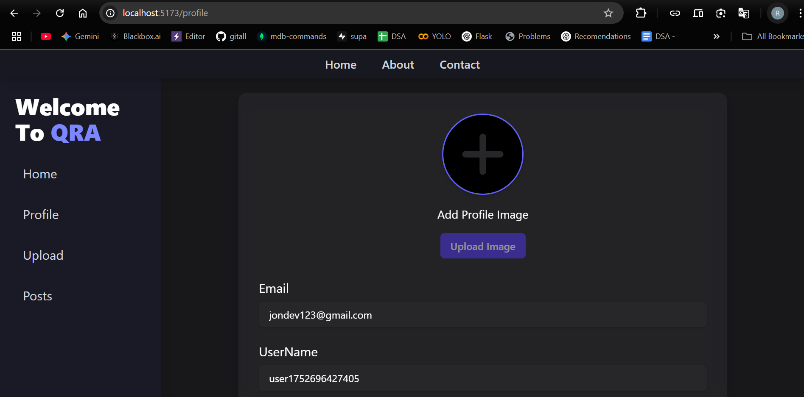
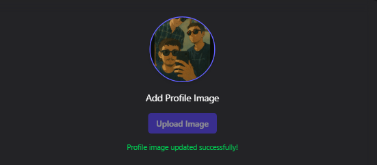

# QRA - Microblogging Platform

QRA (Quick Reach Analysis) is a full-stack microblogging platform where users can post updates in real time, interact with others, and where **admins can analyze platform trends using the Gemini API**. The platform is built with **React, Node.js, Express.js, MongoDB**, and **Tailwind CSS**, and includes user authentication, admin-only dashboards, and future-ready features like sentiment analysis.

> 🎥 [Watch Project Walkthrough Video](https://drive.google.com/file/d/1B_LYvy3s7FUTMwzqltgfhJsVgKWLA-q-/view?usp=sharing)
---

## 🚀 Features

### 🧑‍💻 User Features
- Sign up & secure login
- Create & edit micro-posts
- View top trending posts
- Profile and activity overview

### 🛡️ Admin Features
- Role-based login access
- Dashboard to analyze top 10 daily posts
- Gemini API integration for real-time trend analysis
- Planned: Sentiment analysis for searched users

---

## 📽️ Project Preview


<br/>
## 🔐 Login & Authentication Screens

<div align="flex flex-col">

### ✅ Login Successful  

<p>User successfully logs in with correct credentials.</p>

<br/><br/>

### 🛡️ Token Created  

<p>JWT token is generated and stored upon login for secure session handling.</p>

<br/><br/>

### ❌ Invalid Login Attempt  

<p>Error message shown when invalid credentials are submitted.</p>

</div>

## 🧠 How It Works (Step-by-Step)

### 1. User Signup/Login
- Frontend uses Context API for global auth state.
- Credentials sent to `/api/auth/signup` or `/api/auth/login`.
- Backend validates and returns JWT stored in localStorage.


## 🏠 Homepage UI – Post Feed & Like Flow

<div style="display: flex;  justify-content: space-between; gap: 12px;">
  <div style="flex: 1/3; text-align: center;">
    
    <p><strong>Normal Home Feed:</strong> Default landing feed with latest posts displayed.</p>
  </div>
  <div style="flex: 1/3; text-align: center;">
    
    <p><strong>Like Functionality:</strong> User likes a post and it updates in real time.</p>
  </div>
  <div style="flex: 1/3; text-align: center;">
    
    <p><strong>Refresh Behavior:</strong> Liked post no longer appears after refresh to avoid duplicate likes.</p>
  </div>
</div>

## 🧠 How It Works (Step-by-Step)

### 2. Post Feed and Like Functionality
- On initial page load or refresh, the entire feed is populated using a `useEffect` hook that fires once after authentication is verified.
- This `useEffect` calls the route:

```js
  router.get('/all', checkToken, providePost);
```
- This route is protected by the checkToken middleware, which:
- Verifies the presence and validity of a JWT token
- Decodes the token to identify the user
- Blocks unauthorized requests with a 401 error if invalid

- Posts are rendered with lazy loading. This means:
- Only a limited number of posts are displayed initially
- As the user scrolls, more posts are fetched and rendered dynamically
- This helps maintain performance even with a large number of posts

```js
  router.post('/like/:postid', checkToken, likeHandel);
```
- This route updates the post’s likes array in the database with the user’s ID
- The UI reflects the change immediately using optimistic updates
- On refresh, the liked post is filtered from the main feed to prevent reliking the same post

## 🏠 ProfilePage UI – Update Photo
<div style="display: flex;  justify-content: space-between; gap: 12px;">
  <div style="flex: 1/3; text-align: center;">
    
    <p><strong>Profile :</strong> Default landing with no Image.</p>
  </div>
  <div style="flex: 1/3; text-align: center;">
    
    <p><strong>Profile with Image:</strong>Image Uploded with help of Multer(LocalStorage).</p>
  </div>
</div>


## ⚙️ Tech Stack

| Frontend         | Backend               | Tools / APIs             |
|------------------|------------------------|---------------------------|
| React + Vite     | Node.js, Express.js    | Gemini API (Google AI)    |
| Tailwind CSS     | MongoDB (Mongoose)     | Postman, Git              |
| React Router     | JWT Authentication     | VSCode, GitHub            |
| Context API      |                        |                           |

---

## 📈 System Architecture

📌 *Diagram will be inserted once draw.io images are ready*

---


### 3. Admin Trend Analysis
- Admin dashboard fetches top 10 posts (based on likes).
- Posts are sent to Gemini API → returns summarized trends.
- Admin sees 5-point summaries about community interest.

### 4. Planned Feature – Sentiment Analysis
- Admin will be able to search users and fetch post sentiments.
- Gemini API will analyze tone (positive/negative/neutral).
- Results visualized in the dashboard.

---

## 📁 Folder Structure

